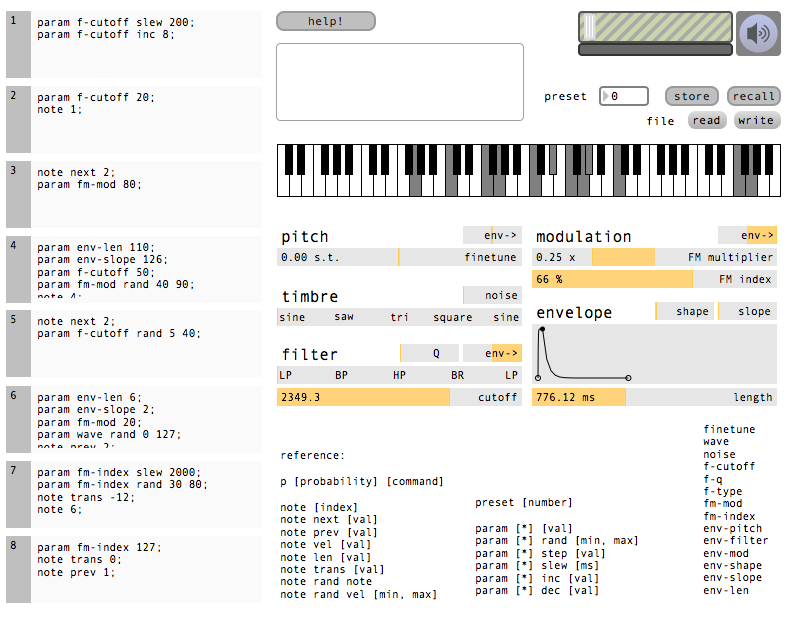

# teletype

event script typing magic

teletype is currently driven by meadowphysics

## how it works 

meadowphysics sends trigger messages 0 to 7 whenever the corresponding rows counters hit zero.

whenever this occurs the relevant event box in teletype is triggered.

this text box can be scripted to enact changes in the synthesizer (or midi output), and multiple lines are allowed per event.

an example event, say in the top-left box:

	note 4;
	cc a rand 50 100;
	p 50 note rand note;

this event happens when the the first meadowphysics row is triggered, sounding note index 4 and creating a cc value between 50 and 100 on cc channel a, and a 50% probability of playing a random note.

note index 4 refers to the 4th note (from low to high) selected in the tone series (highlighted keys on the keyboard). cc a is assigned to the top listed slider. the sliders represent the current value.

presets store pretty much everything. they can be manually recalled or recalled with an event:

	preset 1;
  
this allows for some pretty weird stuff. this is maybe enough information to get you started.
